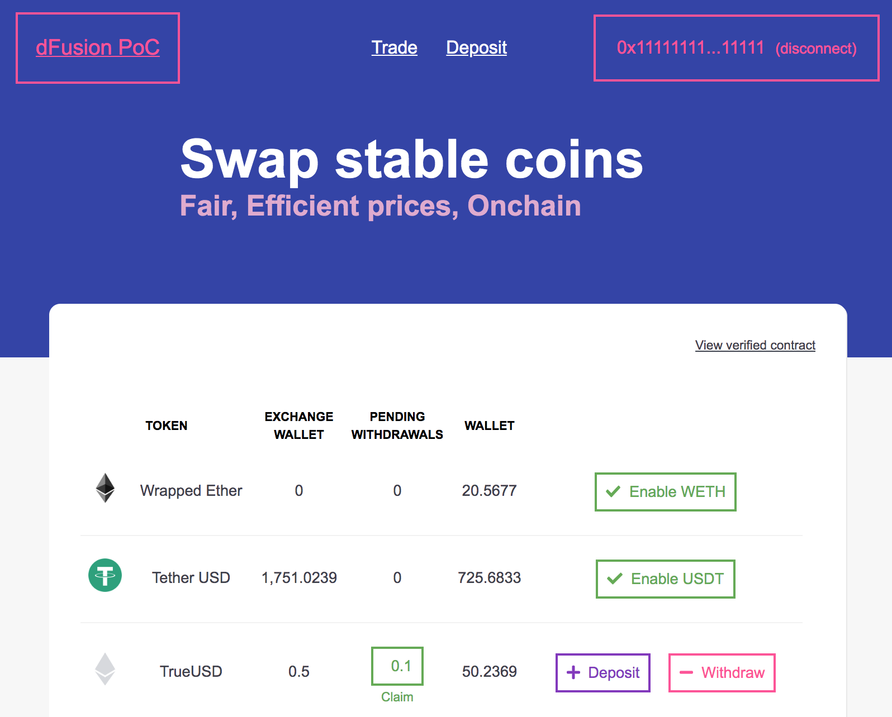

[](https://npmjs.org/package/@gnosis.pm/gp-v1-ui 'View this project on npm')
&nbsp;
[](https://travis-ci.org/gnosis/gp-v1-ui)
&nbsp;
[](https://coveralls.io/github/gnosis/gp-v1-ui?branch=master)

Develop:
&nbsp;
[](https://travis-ci.org/gnosis/gp-v1-ui)
&nbsp;
[](https://coveralls.io/github/gnosis/gp-v1-ui?branch=develop)

# Gnosis Protocol v1 Web

> IMPORTANT: This repository is for the legacy Gnosis Protocol v1
> For the UI for the latest version of the protocol go to: https://github.com/gnosis/gp-swap-ui



`Gnosis Protocol v1 Web` is the first dapp built on the [Gnosis Protocol](https://docs.gnosis.io/protocol).

Gnosis Protocol is a fully permissionless DEX that enables ring trades to maximize liquidity.

`Gnosis Protocol v1 Web` allows users to:

- Create orders in [Gnosis Protocol](https://docs.gnosis.io/protocol)
- See the balances for any token: available in their wallet and on the exchange
- Deposit and withdraw tokens to/from the exchange wallet

## 📚 Wiki

Learn more about Gnosis Protocol v1 Web in the [wiki](https://github.com/gnosis/gp-v1-ui/wiki).

## 🏃‍♀️ Run it locally

```bash
# Install dependencies (we use Yarn but NPM should work too)
yarn

# Start dev server in http://localhost:8080
yarn start
```

Open http://localhost:8080 in your browser.

## 👷‍♀️Build app

```bash
yarn build
```

Static files will be generated inside the `./dist` dir.

## 🧪 Run tests

```bash
yarn test
```

## 🍴Fork it

**Gnosis Protocol v1 Web** can be forked, this way any project can use its own token list, rebrand it, add new pages or modify the existing ones.

Read more [here](https://github.com/gnosis/gp-v1-ui/wiki/Fork-project).

## 🎩 Customizing components

**Gnosis Protocol v1 Web** allows to redefine any React component, so you can add new pages, modify the existing ones, or modify the layout and styles.

Learn about customizing components [here](https://github.com/gnosis/gp-v1-ui/wiki/Customize-Components).

## 🖧 Supported networks
App is currently compatible with Mainnet, Rinkeby, and xDAI. Please refer to the [wiki](https://github.com/gnosis/gp-v1-ui/wiki#-compatible-networks) for further information.

## 🦺 Testnet faucets

Test faucets allow to get some tokens for using them in a testnet.

Gnosis Protocol is deployed and fully functional in Rinkeby testnet.

Read more [here](https://github.com/gnosis/gp-v1-ui/wiki/Testnet-faucets).
